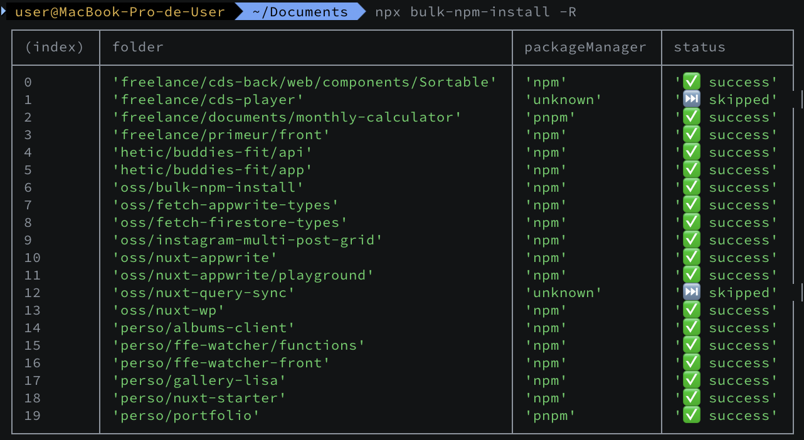

# bulk-npm-install: Install Dependencies Across Multiple Projects


## Quick Usage

Run bulk dependency installation in any directory using a single command. It automatically detects whether to use `npm`, `yarn`, or `pnpm` based on lock files.



Run the following command:

```bash
npx bulk-npm-install -F ./path-to-project -R -L
```

Where:
- `-F` is the root folder where projects are located.
- `-R` enables recursive searching for projects in subdirectories.
- `-L` enables logging.

## Installation

You can install **bulk-npm-install** globally for easy access or use it directly via `npx`.

### Using yarn or npm

```bash
# yarn
yarn global add bulk-npm-install

# npm
npm install -g bulk-npm-install
```

Alternatively, you can use `npx` without global installation:

```bash
npx bulk-npm-install -F ./path-to-project -R -L
```

## Parameters

| Name        | Default Value | Description                                                   |
|-------------|---------------|---------------------------------------------------------------|
| `-F`        | `"./"`        | The parent folder to start scanning for projects.             |
| `-R`        | `false`       | If set, it will recursively scan subdirectories for projects. |
| `-L`        | `false`       | Enables detailed logging during the process.                  |

### Usage

#### CLI

You can pass the parameters in any order. If recursive scanning is required, use the `-R` flag, and logs can be enabled with `-L`. Example:

```bash
npx bulk-npm-install -F ./my-folder -R -L
```

This will scan the `./my-folder`, recursively scan subdirectories, and log the process.

#### Programmatic Use

You can also use **bulk-npm-install** as a module in your JavaScript/TypeScript projects:

```javascript
import { BulkInstall } from 'bulk-npm-install';

const installer = new BulkInstall({
  parentFolder: "./my-project",
  recursive: true,
  logs: true
});

await installer.run();
```

## Results Tracking

Each time **bulk-npm-install** runs, it tracks the results for each folder it processes. Results can be:

- `SUCCESS`: The dependencies were installed successfully.
- `FAILED`: There was an error during installation.
- `SKIPPED`: Multiple lock files were found, and the installation was skipped.

Results are logged and can be viewed in the console once the process completes.
